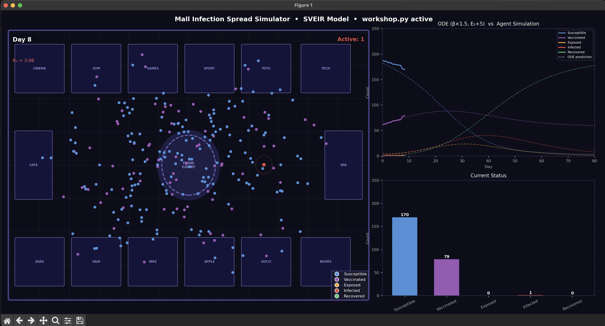

# Disease Outbreak Modeling

Welcome to the coding portion of the workshop! In this repository, you'll be able to visualize disease outbreak in real time, and see how changing initial conditions affects the rate of outbreak.

## Get Started

### 1. Clone the repository using

```
git clone https://github.com/sbbis25/InfectionAlgorithm.git
```

### 2. Install the dependencies

Open a terminal and set the working directory to `InfectionAlgorithm/`, then run:

```
pip install -r requirements.txt
```

### 3. Run the simulation!

If you've installed everything properly, you should be able to run `simulation.py` using

```
python simulation.py
```

and you'll see the visualization suite appear!



On the top right you'll see a live graph of the number of susceptible, vaccinated, exposed, infected, and recovered people.

### 4. Make your changes!

In `workshop.py`, you can change the environment. Here are some ideas to get you started:

1. Use `zone_risk(x, y)` to define high-transmission "heat maps", for example in the "Gym" or in the "Food Court"
2. Use `movement_policy(state, x, y, day, counts, N)` to change how agents move depending on their state, the current day of the simulation, or position. For example, make infected people spread to the edge of the map, or if you're feeling evil, have them all come to the center of the mall.
3. Use `transmission_modifier(...)` to change how the disease spreads from infected agents to susceptible/vaccinated agents. For example, maybe susceptible agents wear masks more than vaccinated agents, and thus have more protection against the virus.

Note: The ODE prediction won't account for arbitrary changes to these rules. Instead, it serves as a comparison of the real world to the theoretical model.

## Glossary

1. `Susceptible` = This agent can become `Exposed` if too close to an `Infected` agent for too long. The agent can also become `Vaccinated` if safe for a long enough time
2. `Vaccinated` = Harder for this agent to turn `Exposed`, but not impossible. A fixed number of agents start out `Vaccinated`
3. `Exposed` = Virus is incubating in this agent, and after some time this agent will turn `Infected`
4. `Infected` = This agent can turn other agents into `Exposed` by being close to them for enough time. After some time, `Infected` agents become `Recovered`
5. `Recovered` = This agent recovered from the virus and can no longer catch the virus